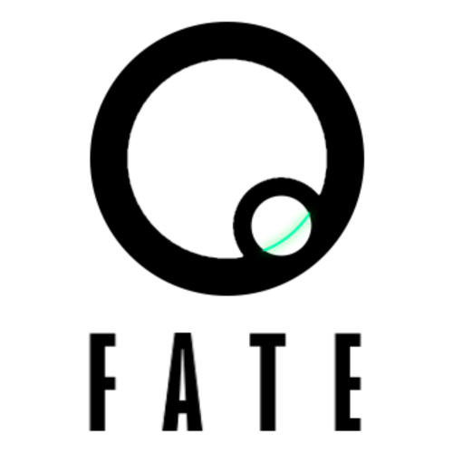

# FATE - A PWA Text Editor 🧠

**Finally, Another Text Editor (FATE)** is a simple code-oriented text editor presented as an installable PWA. It is based off [code written by 2U](https://github.com/coding-boot-camp/cautious-meme), and finished and reworked by me. Undertaken as an effort to understand PWAs.

## Usage ✍

To start the app, head to [https://fate-editor.herokuapp.com/](https://fate-editor.herokuapp.com/). From there, the editor is wide open to you. Whatever you write in the editor will persist even when the page is refreshed or your connection is lost. And if you like JavaScript, then you're in luck, because that's the language the editor uses for its automatic color formatting.

Click the "Install!" button in the upper-left corner to install FATE to your device.

Have fun!

## Challenges Faced 💢

The biggest problem I faced while working on this app was getting the browser to recognize it as installable. Luckily, that turned out to just be a pathing error, and the browser was looking in the wrong place for its service worker. Other than that, everything went rather smoothly.

## Further Development & Contributions 🏗

I will likely not be revisiting this project, and so I don't have anything planned for its future. But I am open to any suggestions or collaborations.
